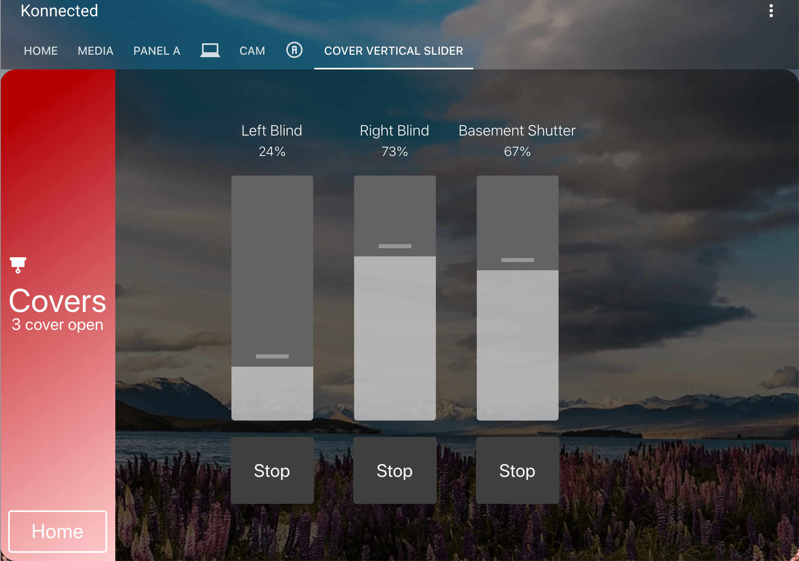
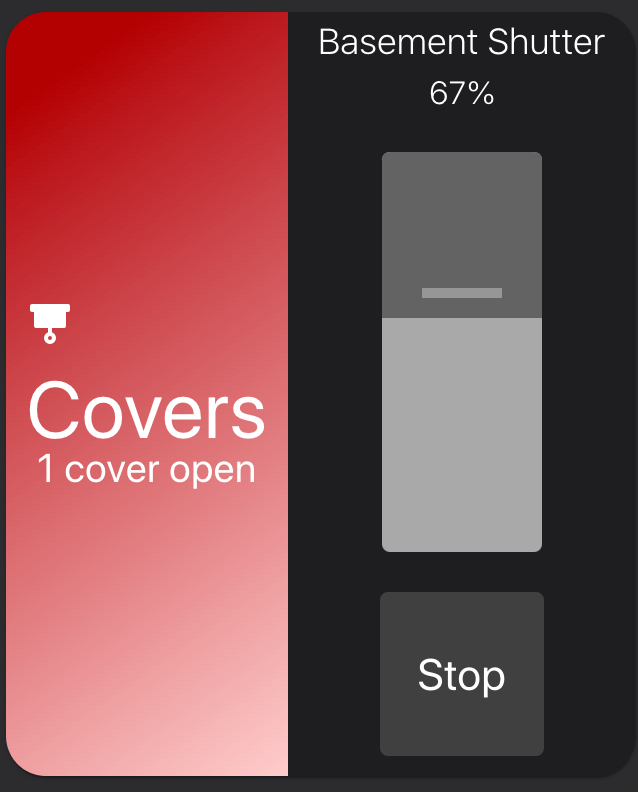

# Vertical Slider Cover Card by konnected.vn (https://konnected.vn - VI)


[![GitHub Release][releases-shield]][releases]
[![License][license-shield]](LICENSE.md)
[](https://github.com/custom-components/hacs)

![Project Maintenance][maintenance-shield]
[![GitHub Activity][commits-shield]][commits]

## SCREENTSHOT

Panel View screenshot



Card screenshot



# Options

| Name              | Type    | Requirement  | Description                                 | Default                  |
| ----------------- | ------- | ------------ | ------------------------------------------- | ------------------------ |
| type              | string  | **Required** | `custom:vertical-slider-cover-card`         |                          |
| title             | string  | **Required** | Title                                       | `VerticalSliderCoverCard`|
| entities          | list    | **Required** | Cover entities to show as slider in card    |                          |
| icon              | string  | **Optional** | Icon to show on side bar                    | ``                       |
| positionHeight    | string  | **Optional** | Height of each slider in px                 | `300px`                  |
| positionWidth     | string  | **Optional** | Width of each slider in px                  | `100px`                  |
| switchHeight      | string  | **Optional** | Height of Stop button at bottom             | `100px`                  |
| switchWidth       | string  | **Optional** | Width of Stop button at bottom              | `100px`                  |
| showButton        | string  | **Optional** | Show Home button at bottom of side bar      | `hide`                   |
| buttonPath        | string  | **Optional** | Path of Lovelace View when click button     | `/lovelace/0`            |
| buttonText        | string  | **Optional** | Text to show on button                      | `Home`                   |
| countText         | string  | **Optional** | Text to show follow number of covers open   | `covers open`            |
| background        | string  | **Optional** | Background in hex (# or hsl with opacity)   | `transparent`            |

## STARTING A NEW CARD FROM vertical-silder-cover-card

### INSTALL USING HACS (recommended)

Add this repo to HACS custom repositories.
repo: https://github.com/konnectedvn/lovelace-vertical-slider-cover-card

Hướng dẫn cài đặt và sử dụng HACS trong Home Assistant có thể xem ở đây (VI - HACS Guide):
https://konnected.vn/home-assistant/home-assistant-cai-dat-hacs-va-theme-2020-03-27

### MANUAL INSTALL

Download vertical-slider-cover-card.js and add it to your /config/wwww/vertical-slider-cover-card (make new dir if it's not exist).

In Home Assistant Dashboard **Resource**, add resource path /local/vertical-slider-cover-card/vertical-slider-cover-card.js, type: module.

`resources`:
```yaml
- url: /local/vertical-slider-cover-card/vertical-slider-cover-card.js
  type: module
```

### ADD NEW CARD

In Lovelace, add new Manual card. Copy sample configuration to replace new card content, adjust entities to fix your Hasss.

In View option, check Panel mode if needed.

#example configuration
```
type: 'custom:vertical-slider-cover-card'
background: 'rgb(0, 0, 0, 0.4)'
buttonPath: /lovelace/0
buttonText: Home
countText: 'covers open'
icon: 'mdi:blinds'
panelType: true
positionHeight: 300px
positionWidth: 100px
showButton: show
switchHeight: 80px
switchWidth: 100px
title: Covers
entities:
  - entity: cover.office_left_blind
    name: Left Blind
  - entity: cover.office_right_blind
    name: Right Blind
  - entity: cover.basement_shutter
    name: Basement Shutter
```
### LAST STEP

Style it using card-mod?

## ISSUE AND SUGGESTION?

Customize to suit your needs and contribute it back to the community.

Found issue? Please raise an issue in this repository or send me email to <duytruong@konnected.vn>

And suggestion and comment are warmly welcome and appreciated!

## MORE WORKS TO DO

1. Remove hard-coded style

2. Support input_number and lights entities in Home Assistant

### Many Thanks to DBuit!

This card is based on his lights-card at: https://github.com/DBuit/hass-smart-home-panel-card.

## Support (just for fun!)

Hey dude! Help me out for a couple of :beers: or a :coffee: (:coffee: is preferred, have enough beers this year)!

[](https://www.buymeacoffee.com/wolverinevn)

[maintenance-shield]: https://img.shields.io/maintenance/yes/2020.svg?style=for-the-badge
[commits-shield]: https://img.shields.io/github/commit-activity/y/konnectedvn/lovelace-vertical-slider-cover-card/lovelace-vertical-slider-cover-card.svg?style=for-the-badge
[commits]: https://github.com/konnectedvn/lovelace-vertical-slider-cover-card/commits/master
[twitter]: https://twitter.com/KonnectedVN
[site]: https://konnected.vn/home-assistant
[license-shield]: https://img.shields.io/github/license/konnectedvn/lovelace-vertical-slider-cover-card.svg?style=for-the-badge&color=red
[maintenance-shield]: https://img.shields.io/maintenance/yes/2020.svg?style=for-the-badge
[releases-shield]: https://img.shields.io/github/v/release/konnectedvn/lovelace-vertical-slider-cover-card.svg?style=for-the-badge&color=red
[releases]: https://github.com/konnectedvn/lovelace-vertical-slider-cover-card/releases
